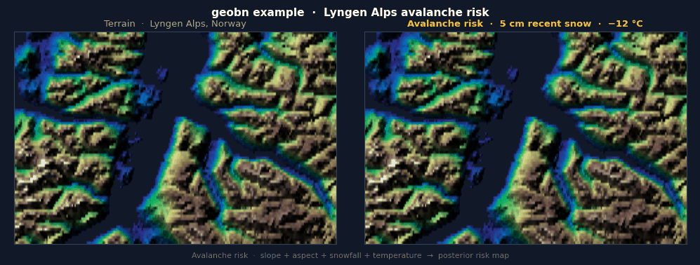

# geobn

[](https://github.com/jensebr/geobn/actions/workflows/tests.yml)
[](https://www.python.org/downloads/)
[](LICENSE)

Bayesian network inference over geospatial data.

Supporting probabilistic AI by turning heterogeneous data sources (offline and real-time) into insight over geographical areas. The library is independent of domain, and may be used for, e.g., environmental risk assessment and risk‑informed route planning.ßß

`geobn` lets you wire data sources — rasters, remote APIs, or plain scalars — directly into a Bayesian network and run pixel-wise inference, producing posterior probability maps and entropy rasters.

Full docs (API reference, concepts, examples) are hosted at:
**https://jensebr.github.io/geobn**



---

## Install

> **PyPI release coming soon.** Until then, install directly from source (Python ≥ 3.13 required):

```bash
uv pip install git+https://github.com/jensebr/geobn.git
```

To also run the bundled examples, clone the repo instead:

```bash
git clone https://github.com/jensebr/geobn.git
cd geobn
uv pip install -e ".[full]"
```

---

## Examples

| Example | Description |
|---|---|
| [`examples/lyngen_alps/`](examples/lyngen_alps/) | Avalanche risk: real Kartverket DTM + configurable weather, Lyngen Alps, Norway |
| [`examples/ship_route_planning_risk/`](examples/ship_route_planning_risk/) | Ship route planning risk: EMODnet Bathymetry + MET Norway + AIS density |

Run from the repo root:

```bash
uv run python examples/lyngen_alps/run_example.py
uv run python examples/ship_route_planning_risk/run_example.py
```

---

## Quick start

```python
import geobn
from pathlib import Path

# Load a Bayesian network from a .bif file
bn = geobn.load(Path("avalanche_risk.bif"))

# Attach data sources to evidence nodes
# slope_angle and aspect are derived from a real Kartverket DEM (see the example)
bn.set_input("slope_angle", geobn.ArraySource(slope_deg,    crs="EPSG:4326", transform=transform))
bn.set_input("aspect",      geobn.ArraySource(north_facing, crs="EPSG:4326", transform=transform))
bn.set_input("recent_snow", geobn.ConstantSource(30.0))   # 30 cm snowfall
bn.set_input("temperature", geobn.ConstantSource(-5.0))   # -5°C

# Define breakpoints for continuous → discrete conversion
bn.set_discretization("slope_angle", [0, 25, 40, 90],   ["gentle", "steep", "extreme"])
bn.set_discretization("aspect",      [0.0, 0.5, 1.5],   ["favorable", "unfavorable"])
bn.set_discretization("recent_snow", [0, 10, 25, 150],  ["light", "moderate", "heavy"])
bn.set_discretization("temperature", [-40, -8, -2, 15], ["cold", "moderate", "warming"])

# Run pixel-wise inference
result = bn.infer(query=["avalanche_risk"])

probs = result.probabilities["avalanche_risk"]  # (H, W, 3) — one band per state
ent   = result.entropy("avalanche_risk")        # (H, W)    — Shannon entropy in bits

# Export
result.to_xarray()          # xarray Dataset  (no rasterio needed)
result.to_geotiff(out_dir)  # multi-band GeoTIFF (requires geobn[io])
```

---

## How it works

```
DataSources  →  align to grid  →  discretize  →  BN inference  →  InferenceResult
```

1. **Load a BN** — `geobn.load("model.bif")` reads a standard `.bif` file via pgmpy.
2. **Attach sources** — each evidence node gets a `DataSource`. All sources are reprojected and resampled to a common grid at inference time (first georeferenced source sets the grid, or call `bn.set_grid()` explicitly).
3. **Discretize** — `set_discretization(node, breakpoints, labels)` bins continuous raster values into the discrete states your BN expects.
4. **Infer** — unique evidence combinations are batched; pgmpy `VariableElimination` runs once per unique combo, not once per pixel.
5. **Export** — `InferenceResult` gives you a numpy array, an xarray Dataset, or a multi-band GeoTIFF (N probability bands + entropy).

---

## Data sources

| Class | Use case |
|---|---|
| `ArraySource(array, crs, transform)` | In-memory numpy array (QGIS, preprocessed data) |
| `RasterSource(path)` | Local GeoTIFF / any rasterio-readable file |
| `URLSource(url)` | Remote Cloud-Optimised GeoTIFF |
| `OpenMeteoSource(variable, date)` | Live weather from [open-meteo.com](https://open-meteo.com/) |
| `ConstantSource(value)` | Broadcast a scalar over the entire grid |

---

## Development

If you want to work on `geobn` itself (rather than just use it), this is how to install it in editable mode and run the test suite locally:

```bash
uv pip install -e ".[dev]"
uv run pytest tests/ -v
```

---

## Academic foundation

`geobn` is a software realisation of ideas developed during the author's PhD research. If you use this library in academic work, please consider citing the following paper:

> J. E. Bremnes, I. B. Utne, T. R. Krogstad, and A. J. Sørensen,
> "Holistic Risk Modeling and Path Planning for Marine Robotics,"
> *IEEE Journal of Oceanic Engineering*, vol. 50, no. 1, pp. 252–275, 2025.
> DOI: [10.1109/JOE.2024.3432935](https://doi.org/10.1109/JOE.2024.3432935)

---

## Declaration of AI use

Parts of this codebase were written with the assistance of Claude (Anthropic). All concepts, design decisions, and research ideas originate with the author.
